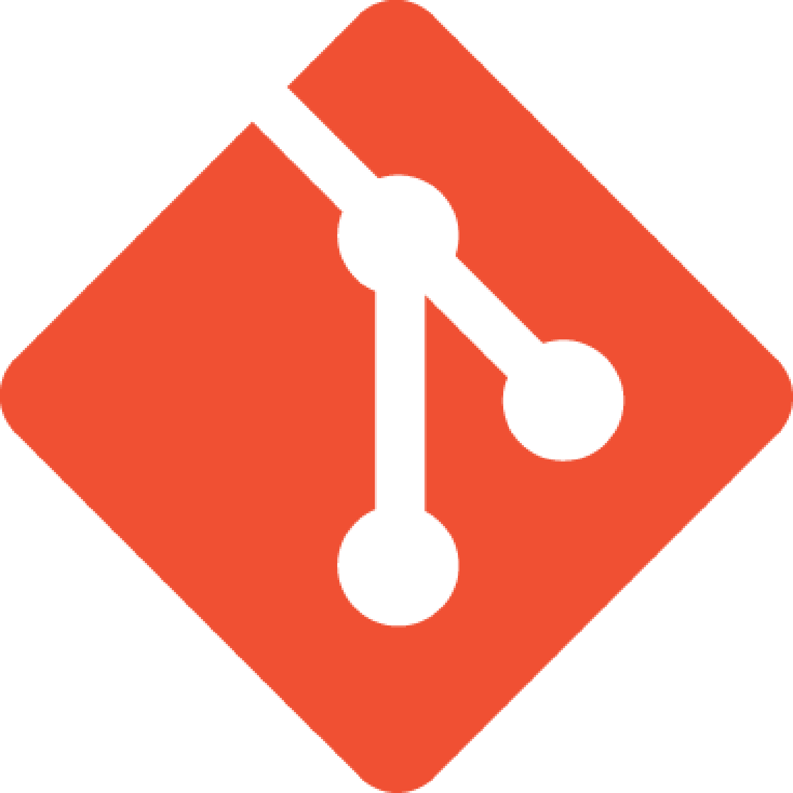

<h2 align="center">Olá 👋, eu sou o Júlio Miguel!</h2>

Apreciador de um bom café ☕ e leitor em horas livres.   <b> Minha paixão é cada vez mais desenvolver códigos de qualidade! </b> 

    

 

<h3 align="center">Você pode me encontrar em</h3>

    
    
    
     
      
      
    <h3>Tecnologias</h3>
     
    
    
    
    
    
    
    
    
     
     
    <!-- <h3>Atividades Recentes</h3> -->

 

<h3 align="center">Github stats :bar_chart:</h3>

<h4 align="center">Top langs :tongue:</h4>

    

       
<h4 align="center">Profile stats :musical_keyboard:</h4>
            

    

    <h2> 
 📃 Curriculum 
 </h3>

## Educação

- 📖 **Ciência da Computação**
    
    📆 2017 - 2021

    📍 **Universidade Federal de Alagoas** - Arapiraca, Alagoas, Brasil

## Experiência

- :computer: Engenheiro de software backend

    📆 ago 2021 

    📍 **Aws Code** - Remoto, MG, Brasil

- :computer: Desenvolvedor Asp.Net (backend)

    📆 jan 2021 - mar 2021

    📍 **Intelitrader** - Remoto, SP, Brasil

- :computer: Desenvolvedor backend Nodejs/TypeScript

    📆 ago 2020 - jan 2021

    📍 **MyInterCambio** - Remoto, PE, Brasil
   
- :computer: Desenvolvedor backend

    📆 jan 2020 - 202?

    📍 **PlusSoft** - Arapiraca, Alagoas, Brasil

- :computer: Projeto Web-Scraping

    📆 dezembro de 2019

<!--
**ojuliomiguel/ojuliomiguel** is a ✨ _special_ ✨ repository because its `README.md` (this file) appears on your GitHub profile.

Here are some ideas to get you started:

- 🔭 I’m currently working on ...
- 🌱 I’m currently learning ...
- 👯 I’m looking to collaborate on ...
- 🤔 I’m looking for help with ...
- 💬 Ask me about ...
- 📫 How to reach me: ...
- 😄 Pronouns: ...
- ⚡ Fun fact: ...
-->

[telegram]: https://t.me/juliomiguelsouza
[twitter]: https://twitter.com/ojuliomiguel
[gmail]: mailto:juliomiguelsouzacosta@gmailcom
[instagram]: https://www.instagram.com/solidcode42
